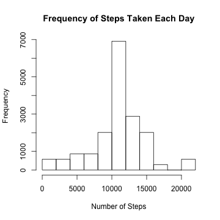

# Reproducible Research: Peer Assessment 1


## Loading and preprocessing the data 

```r
activity.raw = read.csv(unz("activity.zip", "activity.csv"))
activity = na.omit(activity.raw)
```


## What is mean total number of steps taken per day?

```r
library(plyr)
perday2 = ddply(activity, "date", transform, day=sum(steps) )
hist(perday2$day, main= "Frequency of Steps Taken Each Day", xlab="Number of Steps")
```

 


```r
mean(perday2$day)
```

```
## [1] 10766
```

```r
median(perday2$day)
```

```
## [1] 10765
```


## What is the average daily activity pattern?

```r
byinterval = ddply(activity, "interval", transform, meanint=mean(steps))
with(byinterval, plot(interval, meanint,  type="l" ))
```

 


### What is the interval that has the largest average number of steps taken?

```r
byinterval[which.max(byinterval$meanint), "interval"]
```

```
## [1] 835
```


## Imputing missing values  HISTOGRAM

### What are the total number of NA values from the orignal data set?

```r
sum(is.na(activity.raw))
```

```
## [1] 2304
```

### Fill in all of the missing values in the dataset

```r
### this is the avaerage number of  step taken per interval
mean.place = mean(activity$step)
### this replaces NA from the original file with the average
activity.raw[is.na(activity.raw)] = mean.place
activity.replace = activity.raw
```


### How does replacing the NA values affect mean total number of steps taken per day?

```r
perdayNA = ddply(activity.replace, "date", transform, day=sum(steps) )
hist(perdayNA$day, main= "Frequency of Steps Taken Each Day", xlab="Number of Steps", breaks=11)
```

 

### What is the difference between the mean and the median after the NA values are replaced?

```r
mean(perday2$day) - mean(perdayNA$day)
```

```
## [1] 0
```

```r
median(perday2$day) - median(perdayNA$day)
```

```
## [1] -1.189
```

#### Using the average number of steps per 5 minute interval for the total dataset to replace NA did not change the average number of steps and decreased the median by 1.2 steps. 


## Are there differences in activity patterns between weekdays and weekends?


