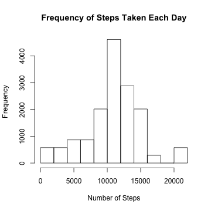
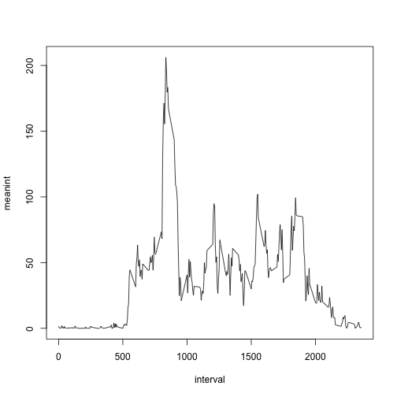

# Reproducible Research: Peer Assessment 1


## Loading and preprocessing the data 

```r
activity.raw = read.csv(unz("activity.zip", "activity.csv"))
activity = na.omit(activity.raw)
```


## What is mean total number of steps taken per day?

```r
library(plyr)
perday2 = ddply(activity, "date", transform, day=sum(steps) )
hist(perday2$day, main= "Frequency of Steps Taken Each Day", xlab="Number of Steps")
```

 


```r
mean(perday2$day)
```

```
## [1] 10766
```

```r
median(perday2$day)
```

```
## [1] 10765
```


## What is the average daily activity pattern?

```r
byinterval = ddply(activity, "interval", transform, meanint=mean(steps))
with(byinterval, plot(interval, meanint,  type="l" ))
```

 


### What is the interval that has the largest average number of steps taken?

```r
byinterval[which.max(byinterval$meanint), "interval"]
```

```
## [1] 835
```


## Imputing missing values  HISTOGRAM


## Are there differences in activity patterns between weekdays and weekends?


